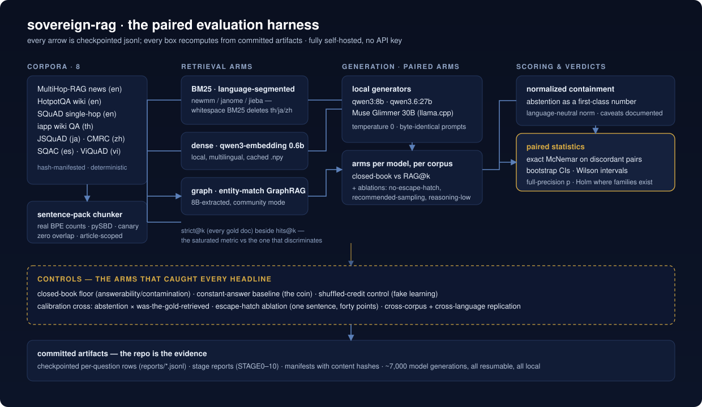

# sovereign-rag

> Production-shaped RAG for when data can't leave the building: local models,
> graph-augmented retrieval, and a feedback loop that makes it measurably better
> every week.

Most RAG demos assume you can send your documents to a cloud API. Banks, hospitals,
telcos, and governments (the organizations I've spent 16 years with) often can't.
`sovereign-rag` is a reference architecture for RAG that runs entirely inside your
perimeter, is instrumented for evaluation from day one, and improves itself against
those evaluations instead of against vibes.

**Status:** the measurement study is complete: stages 0-9 done with
committed artifacts (see [The study](#the-study) and `STATUS.md`). The
productized reference architecture is the next track; the roadmap below is
its build order.

## The study



## Try it on your data

[TUTORIAL.md](TUTORIAL.md) walks through running the study's method on
your own corpus in about fifteen minutes: closed-book arm, paired RAG
lift, the calibration cross, the constant-answer baseline, and the
escape-hatch ablation. One notebook
([examples/minimal_eval.ipynb](examples/minimal_eval.ipynb), committed
with its outputs so it reads on GitHub), one local model, and a bundled
sample dataset to smoke-test first.

Before building the product, this repo ran the measurements the companion
articles are written from. Every number in those posts recomputes from
artifacts committed here. Per-stage reports:

- [Stage 0: machine measurement](reports/machine-measurement.md)
- [Stage 1, retrieval layer: BM25 / dense / hybrid](reports/retrieval.md)
- [Stage 2: the graph arm](reports/graph-arm.md)
- [Stage 3: generation arms](reports/generation-arms.md)
- [Stage 4: the learning layer (pre-registered negative)](reports/learning-layer.md)
- [Stage 6: pushing on the claims](reports/claim-stress-tests.md) (includes the
  full-corpus replication, `reports/stage5_full_corpus.json`)
- [Stage 7: the cross-domain replication (HotpotQA)](reports/hotpotqa-transfer.md): the winner flips, the metric lesson transfers
- [Stage 8: Muse Glimmer 30B, day one](reports/glimmer-day-one.md)
- [Stage 9: the five-language replication](reports/five-language-replication.md)
- [Stage 10: the three confound-closers](reports/confound-closers.md): escape-hatch ablation, English single-hop control, 27B entity probe

Entry points for stages 8-10: `ops/escape_hatch_ablation.py`,
`ops/recency_vs_scale_27b.py`, `ops/prep_en_squad.py`, `ops/stage8_glimmer.py`
and `ops/stage9_lang.py` + `ops/run_multiling.sh` (driver; its header
documents the llama-server/ollama prerequisites). Model binaries are not
committed; `models.manifest.json` records their hashes and runtime pins.

Regenerating from scratch (the `.gitignore` contract: large regenerable
files are not committed, manifests carry their content hashes):

1. `python ops/fetch_data.py` (source parquets + `data/sources.manifest.json`)
2. `python src/chunker.py --budget 600` (chunk files, sha-manifested)
3. `python src/embed_index.py --budget 600` (embeddings via local ollama)
4. stage scripts under `ops/` in stage order; each is checkpointed/resumable

Known gap: the stage-9 multilingual corpora are committed but their prep
script is not. See the provenance caveat in
[reports/five-language-replication.md](reports/five-language-replication.md).

## Three pillars

1. **Local-first (sovereignty).** Every component runs on your hardware: local LLM
   (Ollama / vLLM), local embeddings, Postgres + pgvector, no external calls, audit
   logging on every query. Sovereignty is an architecture decision, not a compliance
   checkbox.
2. **Graph-augmented (GraphRAG).** Entity and relationship extraction, done with local
   models, into a knowledge graph, and hybrid retrieval (vector + graph traversal)
   for the multi-hop questions vector search can't answer ("which suppliers are
   affected if regulation X changes?"). Microsoft's GraphRAG popularized the
   pattern; this repo's contribution is a fully-offline, eval-instrumented
   implementation sized for an enterprise pilot, with honest notes on what local
   graph construction actually costs.
3. **Self-improving (measured, not magic).** User feedback and eval scores from
   [agent-report-card](https://github.com/netsatsawat/agent-report-card) feed a tuning loop: query rewriting,
   chunk re-weighting, and retrieval-strategy routing (vector vs graph vs hybrid)
   adjust over time, and every change must pass an eval regression gate before it
   sticks. "Self-improving" means the report card number goes up and you can prove it.

## Architecture

```
ingest:  docs ─→ chunker ─→ embedder ─→ pgvector
              └→ entity/relation extractor ─→ graph store
query:   question ─→ router ─→ vector | graph | hybrid retrieval
                                  └─→ generation + citations ─→ answer
learn:   feedback + eval scores ─→ tuner ─→ router & retrieval params
                                     └─ eval regression gate (agent-report-card)
```

## Roadmap

- **v0.1**: baseline local RAG: ingestion, pgvector retrieval, cited generation,
  eval hooks. Docker-compose up in one command.
- **v0.2**: GraphRAG module: offline graph construction, hybrid retrieval, a
  multi-hop eval set that shows *when* graph beats vector (and when it doesn't).
- **v0.3**: self-improving loop: feedback capture, eval-gated auto-tuning,
  weekly report-card diff.
- **v0.4**: deployment hardening: RBAC hooks, audit log export, air-gap notes.

## Who this is for

Teams in regulated or data-sensitive environments piloting RAG without sending a
single token outside, and practitioners who want an honest look at the
engineering trade-offs of local GraphRAG.

---

Written by [Satsawat Natakarnkitkul](https://satsawat.ai), a data & AI leader in
ASEAN, author of *Why Your AI Agent Will Fail*. Companion articles at
[satsawat.ai](https://satsawat.ai) · Newsletter:
[AI in Practice](https://satsawat.ai/#newsletter)

License: MIT
